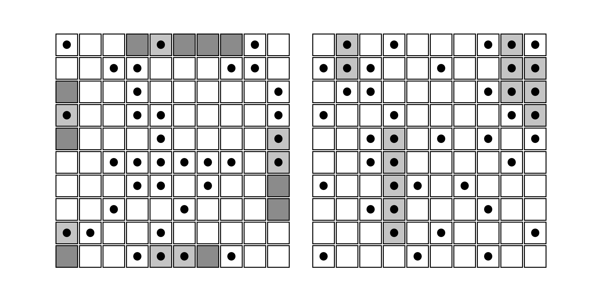

# Game: Battleship

This is a project assigned by TheOdinProject. For more information, please refer to [their curriculum](https://www.theodinproject.com/lessons/node-path-javascript-battleship).

This project is a web version of the famous board game [Battleship](<https://en.wikipedia.org/wiki/Battleship_(game)>). Players first deploy their given fleet (5 ships as the 1990 Milton Bradley version goes) on their grid. On battle, players get to guess and hit his enemy's tiles in order to destroy all their fleet. Who destroys all opponents' fleet first will wins.

## Preview

[Live Demo](https://69kwan69.github.io/game_battle-ship)



## Installation

To get a copy of the game, please follow the installation guide step-by-step:

1. Clone and install required packages to local machine

```bash
git clone https://github.com/69kwan69/game_battle-ship.git
cd ./game_battle-ship
npm install
```

2. Dump the project you just installed. _You actually installed it?_

## Feature Defects

Most of the defects are about the UI/UX. To name a few:

- **Drag'n'Drop:** Unable to customize the ghost image (dragged item) to remove the low opacity effect or transparent edges.

- **Ready-to-drop effect:** The drop preview (or the item dragged being snapped) is poor.

- **Sound Effects:** Missing sound effects for actions like placing ships or hitting opponent's tile.

- **Naming player:** Not even a simple choice to enter player's name.

- **Other:** Poor color choices, bland design, no text for instructions whatsover.

There would exist some bugs that I didn't even bother find it. Why isn't there any features section? Because I wouldn't call the rest that works as 'features'.

## My thoughts

This is my first hands-on drag'n'drop api, and the experience developing with it is terrible. It's biggest problem was the ghost image being unable to customized. There's a [blog post](https://www.kryogenix.org/code/browser/custom-drag-image.html) that dedicates to this problem that I recommend checking it out. The lesson here is to get yourself to the nearest library or make yourself a drag'n'drop behaviors using mouse events. I spent too much time on developing the logic of the game () that I actually couldn't focus on other design aspects such as sound effects or semantic instructions for better game flow. And this is the problem with vanilla HTML, CSS and JS, they have limits and are inefficient. I realized that I have to continue with the curriculum and get my hands on JS frameworks ASAP while being a self-taught programmers. So I stopped with this project (of course I took it seriously and completed all the criterias as a game) and wrote a whole wall of text to justify myself on my negligence of the project, also to convince myself not being a loser. I need to sleep.
